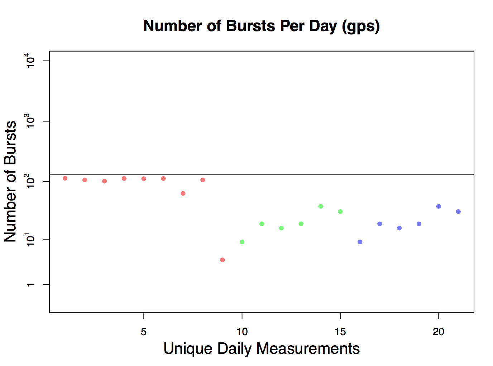
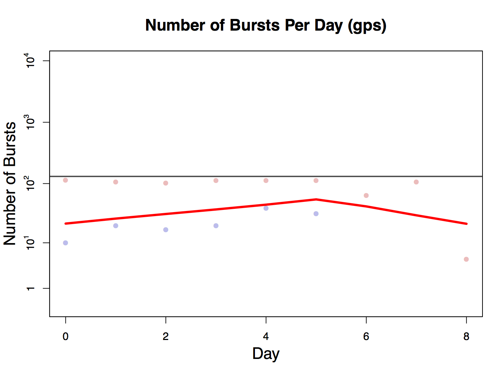

# Running the Beiwe-Analysis code locally

This documentation will demonstrate a guideline of how to run the Beiwe-Analysis code locally and will also provide introduction for each function.

## Table of Contents
- [Environment Setup](#environment-setup) 
- [Introduction to the functions involved in Beiwe-Analysis](#introduction-to-the-functions-involved-in-beiwe-analysis)
    - [Preprocessing](#preprocessing)
    - [Processing](#processing)
    - [Outputs](#outputs)
    - [Utility](#utility) 

## Environment Setup

Some of the Beiwe-Analysis code references **`Python`** or **`C`**-related code for speed, but most of this code is in **`R`**, so we suggest running the code in the **`Rstudio`**. If you already have **`Rstudio`** installed, we suggest updating it to the latest version.

The following steps instruct how to install necessary packages including **Rcpp** that facilitate interfacing **`C`** code in R Packages. 

- **Rcpp requires gcc and gfortran installed**
    - **For macOS users**:
        - Open the terminal console, and check if you already installed Xcode Command Line Tools by typing:
            ```
            $ xcode-select -p
            ```
         	If you see the following returns then the full Xcode package is already installed
	     	```
	      	/Applications/Xcode.app/Contents/Developer
	     	```
			If not, enter the following to install
			```
			$xcode-select --install
			```
			The following can be used to verify **`gcc`** is installed:
			```
			$gcc --version
			```
		- The next step is to install **`gfortran`**. Follow the steps in [How to install gfortran on Mac OS X](http://skipperkongen.dk/2012/04/27/how-to-install-gfortran-on-mac-os-x/).
    - **For windows users**, ...

- **Install/Load Required R Packages and Set Directories in Rstudio**


    - Open **Rstudio** and run the following code to install/load all the R packages needed for the Beiwe-Analysis:
        ```
        list.of.packages = c(
          "Rcpp",
          "RcppArmadillo",
          "mvtnorm",
          "Matrix",
          "MCMCpack",
          "VGAM",
          "stringr",
          "plyr",
          "pryr",
          "dplyr",
          "tidyr",
          "purrr",
          "tibble",
          "lme4",
          'lmerTest',
          'glmmLasso'
        )

        new.packages <- list.of.packages[!(list.of.packages %in% installed.packages()[,"Package"])]
        if(length(new.packages)) install.packages(new.packages)
        lapply(list.of.packages, require, character.only = TRUE)


        detach("package:plyr", unload=TRUE)

        ```
    - Set filepaths for code source, patient data and analysis output in Rstudio. Below is an example to set these filepaths:
    	
	   ```
	   source_filepath    = "/Users/OnnelaLab/Beiwe-Analysis"
	   data_filepath      = "/Users/OnnelaLab/Sample-Data"
	   output_filepath    = "/Users/OnnelaLab/output"
	   root_filepath      = "/Users/OnnelaLab/"
	   ```

## Introduction to the functions involved in Beiwe-Analysis
### Preprocessing

#### surveys_preprocessing
```
function(patient_name, ...){
  ...
          specific_survey_data[,"survey_id"]      = survey_name
          specific_survey_data["date"]            = date
          specific_survey_data[,"patient_name"]   = patient_name
          specific_survey_data[,"timestamp"]      = timestamp
          specific_survey_data[,"date"]           = as.Date(date)
          survey_data[[specific_survey_filepath]] = specific_survey_data
        }
  ...
```

survey preprocessing:
in this preprocessing, we call each patient name by loop and read survey data  from “specific survey filepath”. If there exists information in the survey file, we read the information by such order that: survey name, date, patient name, timestamp, etc. We store this information into several lists and that save then as RDS file.


#### text_preprocessing
```
function(patient_name, ...){
  ...
		textmat[,"timestamp"] = textmat[,"timestamp"] / 1000
		textmat = textmat[,-2]
		textmat[,c("hours","days")] = hours(textmat[,"timestamp"])
    }
  }
  saveRDS(textmat, paste(output_filepath, "/Preprocessed_Data/Individual/",patient_name, "/text_data.rds",sep=""))
}
```

calling the text preprocessing function, we create textmat by adding information from texts file. To be specific, we first convert textmat by dividing it by 1000. Then we created the variable the variables "hours","days" by splitting the variable  "timestamp”. The reason to do this is since timestamp combine the information of hours and days and we want to extract them from this variable. 


#### calls_preprocessing
```
function(patient_name, ...){
 ...
			callmat = rbind(callmat, data = read.csv(paste(calls_filename,"/",call_file,sep=""),header=T))
		callmat[,"timestamp"] = callmat[,"timestamp"] / 1000
		callmat = callmat[,-2]
		callmat[,c("hours","days")] = hours(callmat[,"timestamp"])
    }
  }
  saveRDS(callmat, paste(output_filepath, "/Preprocessed_Data/Individual/",patient_name, "/call_data.rds",sep=""))
}
```
to call the calls preprocessing, we read files from our working directory and basically did the same thing as the text preprocessing. We also want to combine information from each file and split the variable "timestamp” into “hours” and “days” and convert them information and store them in the format of call.


#### powerstate_preprocessing
```
function(patient_name, ...){
	...
		  statemat = do.call(rbind, statemat)
		  statemat[,1] = statemat[,1] / 1000
		  statemat = statemat[,-2]
		  statemat[,c("hours","days")] = hours(statemat[,"timestamp"])
		  saveRDS(statemat, power_state_filename)
		}
	}
}
```

to call the powerstate preprocessing, we read files from our working directory and basically did the same thing as the text preprocessing. We also want to combine information from each file and split the variable "timestamp” into “hours” and “days” and convert them information and store them in the format of statemat and store them in RDS file.


#### accelerometer_preprocessing
```
function(patient_name, minutes, verbose = TRUE, ...){
...
		accmat[,1] = accmat[,1] / 1000
		accmat = accmat[,-2]
		accmat[,c("hours","days")] = hours(accmat[,"timestamp"])
		saveRDS(accmat, patient_data_filename_RDS)
		file.remove(patient_data_filename_TXT)
	  }
  }
}
```

to call the accelerometer_preprocessing, we read files from our working directory and basically did the same thing as the text preprocessing. We also want to combine information from each file and split the variable "timestamp” into “hours” and “days” and convert them information and store them in the format of accmat and store them in RDS file.

}}


#### find_bursts
```
find_bursts = function(patient_name,
						stream,
						millisecond_divider,
						code_filepath = paste(source_filepath, "/Preprocessing/find_bursts.py",sep=""),
						verbose = TRUE,
						...)
{						  
...
  
  if(file.exists(patient_data_filename_RDS)){
  if(verbose) cat(paste(stream, "bursts file already exists.\n"))
  }else{
    system(paste("python", code_filepath, data_filepath, patient_data_filename_TXT, patient_name, stream, millisecond_divider))
	data = read.csv2(patient_data_filename_TXT, sep=",", header=T)
...

```

this function we input the names of patients and the filepath of code to find bursts. If the file already exists, then we report the information as “bursts file already exists”, otherwise we retrieve the information by calling “system” function and combine the filepath from code, data, patient_data_filename_TXT, patient_name, etc. and save it as RDS.


### Processing
#### Call_features

```
call_features = function(callmat){
  # input:  callmat, a processed array of calls
  # output: call_features, a processed array of calls features
  day = function(timestamp) strsplit(as.character(as.POSIXct(timestamp,tz="",origin="1970-01-01"))," ")[[1]][1]
  callmat_f = callmat # callmat for the features
  callmat_f[,"day"] = sapply(callmat[,"timestamp"], day)

  outgoing_calls = callmat_f %>%
    group_by(day) %>%
    filter(call.type == "Outgoing Call") %>%
    summarise(outgoing_calls = n())

  outgoing_calllengths = callmat_f %>%
    group_by(day) %>%
    filter(call.type == "Outgoing Call") %>%
    summarise(outgoing_calllengths = sum(duration.in.seconds))

  call_outdegree = callmat_f %>%
    group_by(day) %>%
    filter(call.type == "Outgoing Call") %>%
    select(day, hashed.phone.number) %>%
    distinct(hashed.phone.number) %>%
    summarise(call_outdegree = n())

...
omit the corresponding code of incoming calls
...

  send_receive_changes = function(x) sum(abs(diff(as.integer(x == "Outgoing Call"))))
  call_reciprocity = callmat_f %>%
    group_by(day, hashed.phone.number) %>%
    summarise(changes = send_receive_changes(call.type)) %>%
    summarize(reciprocity = sum(changes))

  response_time = function(x, y){# specifically, hours until responded to a call
    where = which((diff(as.integer(x == "Outgoing Call"))) > 0)
    output = mean(y[where+1]-y[where], na.rm=TRUE)
    round(output / 60 / 60, 2)
  }
  call_responsiveness = callmat_f %>% 
    group_by(day, hashed.phone.number) %>%
    summarize(responsiveness = response_time(call.type, timestamp)) %>%
    summarize(responsiveness = mean(responsiveness, na.rm=TRUE))

  call_feature_list = list(outgoing_calls, outgoing_calllengths, call_outdegree, 
                           incoming_calls, incoming_calllengths, call_indegree,
                           call_reciprocity, call_responsiveness)

  call_features = Reduce(full_join, call_feature_list) # reduces each feature to days for which data is available.
  # call_features[,"outgoing_calls"]/call_features[,"incoming_calls"]
  call_features = data.frame(call_features)
  return(call_features)
}
```

Call_features is a long function, which is used to retrieve information of features in data.
Basically, this function input the information of callmat, a processed array of calls, and output (call_features), a processed array of calls features
To be specific, We have the variable of “day”, which is used for grouping the information by days. Then we collect information of outgoing/incoming calls, the length of outgoing/incoming calls, the degree of outgoing/incoming calls, changes, responsive time, etc., and obtain the information by days in numeric unit. In the end, we combine these information and join them into one data frame.


#### Call_locations
```
call_locations = function(callmat, mobmat){
	calllocs = NULL
	calllocs = callmat[,1] %>%
		map(GPSlocation, mobility_matrix = mobmat) %>%
		do.call(rbind, .) %>%
		as.data.frame() %>%
		cbind(callmat[,c("duration.in.seconds","call.type")])
	colnames(calllocs) = c("x","y", "code", "timestamp","length","call.type")
	calllocs[,c("hours","days")]  = hours(calllocs[,"timestamp"])
	return(calllocs)
}
```
this function inputs the callmat and mobmat, and then uses the first column of callmat matrix to map into GPS location. After obtain the timestamp, we combine this information with the duration in second and types of the call. In the end, this function outputs the calllocs, the matrix contains the information of the call, including the days, hours, type and length.


#### CombineSurveyResponses
```
combine_survey_responses = function(srvyinds,groupings,labels){
  featurefile=paste(output_filepath,"/Processed_data","/Group",sep="")
  filename=paste("feature_matrix_clean_",daysback,"daycarry.rds",sep="")
  outfilename=paste("feature_matrix_clean_",daysback,"daycarry_combined.rds",sep="")
  outtxtname=paste("feature_matrix_clean_",daysback,"daycarry_combined.txt",sep="")
  infilename=paste(featurefile,filename,sep="/")
  if(!file.exists(infilename)){return(NULL)}
  dat=readRDS(infilename)[[1]]
  #dat=read.csv(paste(fileloc,filename,sep="/"),stringsAsFactors=FALSE,header=TRUE,sep="\t")
  outmat = cbind(dat[,1:2],matrix(NA,ncol=length(groupings),nrow=nrow(dat),dimnames=list(NULL,labels)),dat[,(max(srvyinds)+1):ncol(dat)])
  for(j in 1:length(groupings)){
    INDsPICK = groupings[[j]]
    for(i in 1:nrow(dat)){
      nAns=length(which(!is.na(dat[i,INDsPICK])))
      if(nAns>0){
        outmat[i,2+j]=sum(as.numeric(dat[i,INDsPICK]),na.rm=T)/(nAns)
      }
    }
  }
  saveRDS(list(outmat),paste(featurefile,outfilename,sep="/"))
  write.table(outmat,file=paste(featurefile,outtxtname,sep="/"),sep="\t",quote=FALSE,row.names=FALSE)
}
```
the function is used for combing survey response. Based on the response of survey, we remove NA and files which do not exist. By running loops, we conclude the information of average of grouping in each entry. By this aggregation and operation step, we combine the information from survey.


#### coverage_over_time
```
coverage_over_time = function(stream,
                              verbose = TRUE,
                              ...)
...

if(!file.exists(input_filename)){
    if(verbose) cat("Bursts file does not exist.\n")
  }else{
    bursts   = readRDS(input_filename)
    n_patients = bursts %>% data.frame %>% dplyr::select(patient) %>% unique %>% unlist %>% length
    coverage_over_time = bursts %>%
      group_by(zeroed) %>%
      summarize(
        total_coverage_across_all_patients = sum(total_coverage,na.rm=T)/n_patients,
        total_coverage_across_active_patients = mean(total_coverage,na.rm=T),
        num_bursts_coverage = mean(num_bursts_coverage,na.rm=T),
        within_burst_length_coverage    = mean(within_burst_length_coverage,na.rm=T),
        within_burst_frequency_coverage = mean(within_burst_frequency_coverage,na.rm=T)
      )
	  coverage_over_time = coverage_over_time %>% data.frame
	  coverage_over_time[is.infinite(coverage_over_time[,"within_burst_frequency_coverage"]),"within_burst_frequency_coverage"] = 1
    saveRDS(coverage_over_time, results_filename)
  }
}
```
this function is used for calculating the coverage of patients. We first obtain the total number of patience, and then aggregate information of total coverage across all patients, total coverage across all active patients, number of bursts coverage. After this aggregation, we convert them into data frame of coverage over time. If the information in coverage over time is infinite, we define this case as one.


#### find_questions
```
find_questions = function(...){
...

    if(file.exists(patient_survey_filename))
      questions[[patient_name]] = readRDS(patient_survey_filename) %>% dplyr::select(question.text) %>% unlist %>% as.character
  }
  questions = do.call(c, questions) %>% unique
...
```
this function is used for find question by calling each patient name and finding the corresponding filename of survey for each patient. 


#### get_days
```
get_days = function(...){
	list(...) %>%
    lapply(function(x) x[,'days']) %>%
    Reduce(union, .) %>%
    unique %>%
	sort %>%
	setdiff("NA")
}
```
we input any number of dataframe objects with a "days" column and output a vector of all the unique days.


#### hours
```
hours = function(timestamps
  days = timestamps %>% unlist %>% as.POSIXlt(origin = "1970-01-01") %>%
    as.character %>%
    map(function(x){if(is.na(x)){return(c("NA","NA"))}else{return(strsplit(x, " "))}}) %>%
    unlist %>%
    matrix(nrow=2) %>%
    t
  days = days[,1]
  hours = as.POSIXlt(timestamps, origin = "1970-01-01") %>%
    map(function(timestamp){timestamp %>%
        unclass() %>%
        unlist()}) %>%
    data.frame() %>% 
    cbind(timestamps) %>%
    dplyr::select(hour, min, sec) %>%
    apply(1, function(times) sum(times * c(1, 1/60, 1/3600)))
  output = as_data_frame(cbind(hours=hours, days=days))
  output["hours"] = lapply(output["hours"], as.numeric)
  return(output)
}
```
this function is used for converting timestamps into hour of the day. We first remove the data as “NA” and use as.POSIXlt to extract the information of hour. We convert them into units of minutes and seconds. Finally, this function return the column of “hour”.


#### model_data_quality_predictiveness
```
model_data_quality_predictiveness = function(questions_filter, SHIFT){
  patient_names = list.files(data_filepath)[-grep("\\.",list.files(data_filepath))]
  weekly_coverage = function(stream, shift, ...){
    data = readRDS(paste(output_filepath, "/Preprocessed_Data/Group/", stream, "_bursts.rds", sep="")) %>% data.frame %>% subset(complete.cases(.))
    data[,"zeroed_week"] = data[,"zeroed"] %/% 7 + shift
    return(
      data %>% group_by(patient, zeroed_week) %>% summarize(
        #mean_num_bursts_coverage = mean(num_bursts_coverage),
        #mean_within_burst_length_coverage = mean(within_burst_length_coverage),
        #mean_within_burst_frequency_coverage = mean(within_burst_frequency_coverage)
        mean_total_coverage = sum(total_coverage)/7
      )
    )
  }
  create_zeroed_columns = function(data, shift){
    data[,"zeroed"] = 0
    mins = data %>% group_by(patient) %>% summarise(min_date = min(numeric_date))
    for(pat in patient_names){
      sub = which(data[,"patient"]==pat)
      data[sub,"zeroed"] = data[sub,"numeric_date"]-unlist((mins %>% filter(patient == pat))[,"min_date"])
    }
    data[,"zeroed_week"] = data[,"zeroed"] %/% 7 + shift
    return(data)
  }
  
weekly_accelerometer = weekly_coverage("accelerometer", shift = SHIFT)
  weekly_gps = weekly_coverage("gps", shift = SHIFT)
  
  timings = readRDS(paste(output_filepath, "/Processed_Data/Group/survey_timings.rds", sep="")) %>% data.frame %>% subset(complete.cases(.))
  timings[,"numeric_date"] =as.numeric(as.Date(as.POSIXct(timings[,"Notified"],origin="1970-01-01")))
  colnames(timings)[which(colnames(timings) == "Person")] = "patient"
  timings = timings %>% data.frame
  timings[,"time_to_present"] = log10(timings[,"Present"]-timings[,"Notified"])
  timings[,"time_to_submitted"] = log10(timings[,"Submitted"]-timings[,"Present"])
  timings = create_zeroed_columns(timings, shift = SHIFT)
  timings = timings[complete.cases(timings)&(!is.infinite(timings[,"time_to_present"]))&(!is.infinite(timings[,"time_to_submitted"])),]
  weekly_timings = timings %>% group_by(patient, zeroed_week) %>% summarize(
    mean_time_to_present = mean(time_to_present),
    mean_time_to_submitted = mean(time_to_submitted)
  ) %>% data.frame
  
  surveys = list()
  for(patient_name in patient_names){
    patient_survey_filename = paste(output_filepath, "/Preprocessed_Data/Individual/",patient_name, "/survey_data.rds",sep="")
    if(file.exists(patient_survey_filename))
      surveys[[patient_name]] = readRDS(patient_survey_filename) %>% dplyr::filter(question.text %in% questions_filter) %>% group_by(survey_id, timestamp) %>% summarize(count=n(), mean_score = mean(as.numeric(answer),na.rm=T), completion = sum(!is.na(as.numeric(answer)))) %>% data.frame %>% mutate(patient = patient_name)
  }
  surveys = do.call(rbind, surveys)
  surveys[,"date"] = as.factor(as.Date(as.POSIXct(surveys[,"timestamp"],origin="1970-01-01")))
  surveys[,"numeric_date"] = as.numeric(surveys[,"date"])
  surveys = create_zeroed_columns(surveys, shift = 0)
  weekly_surveys = surveys %>% group_by(patient, zeroed_week) %>% summarize(mean_score = mean(mean_score), completion = sum(completion))
  
  
  
  data=Reduce(function(...) merge(..., all = TRUE, by = c("patient", "zeroed_week")), 
              list(weekly_accelerometer, weekly_gps, weekly_timings, weekly_surveys))
  #data[which(is.infinite(data[,"mean_within_burst_frequency_coverage.y"])),"mean_within_burst_frequency_coverage.y"] = NA
  
  
  
  mod = lmer(mean_score~mean_total_coverage.x + mean_total_coverage.y + 
               mean_time_to_present + mean_time_to_submitted + completion + (1|patient), data=data)
  return(mod)
}
```
First of all, this function groups the data by patient and aggregate information of coverage. Then creates zeroed column and zeroed week. Secondly, we define the variable of weekly_accelerometer, weekly_gps by calling “weekly_coverage” function. After removing the “NA”, and including time variables such as “time_to_present” and “time_to_submitted”, we have the new data of weekly_timeing. In the end, we convert the date into “hours”, and finalizing our data by combing these information together (weekly_accelerometer, weekly_gps, weekly_timings, etc.)


#### powerstate_locations
```
powerstate_locations = function(statemat, mobmat){
	statelocs = NULL
	statelocs = statemat[,1] %>%
		map(GPSlocation, mobility_matrix = mobmat) %>%
		do.call(rbind, .) %>%
		as.data.frame() %>%
		cbind(statemat[,c("event")])
	colnames(statelocs) = c("x","y", "event","timestamp","screen")
	statelocs[,c("hours","days")] = hours(unlist(statelocs[,"timestamp"]))
	statemat[,c("hours","days")]  = hours(statemat[,"timestamp"])
	return(statelocs)
}
```
this function inputs the statemat and mobmat, and then uses the first column of statemat matrix to map into GPS location. After obtain the timestamp, we combine this information with the duration in second and types of the call. In the end, this function outputs the statelocs, the matrix contains the information of the call, including the days, hours, type and length.


#### ReplicateSurveyResponsesBackwards
```
fill_in_NAs = function(...){
  patient_input_filepath = paste(output_filepath, "/Processed_Data/Group",sep="")
  patient_input_filename = paste(patient_input_filepath, "/feature_matrix.rds",sep="")
  patient_output_filename = paste(patient_input_filepath, "/feature_matrix_clean.rds",sep="")
  if(!file.exists(patient_input_filename)){return(NULL)}
  dat=data.frame(readRDS(patient_input_filename)[[1]])
  for(i in 1:nrow(dat)){
    for(j in 1:ncol(dat)){
      if(is.na(dat[i,j])){next}
      if(is.nan(dat[i,j])){dat[i,j]=0}
      if(dat[i,j]=="NaN"){dat[i,j]="0"}
      if(dat[i,j]==""){
        dat[i,j]=NA
        next
      }
      if(dat[i,j]=="NOT_PRESENTED"){
        dat[i,j]=NA
      }
    }
  }
  saveRDS(list(dat),patient_output_filename)
  #write.table(dat,file=paste(fileloc,"/",strsplit(filename,split='\\.')[[1]][1],"CLEAN.txt",sep=""),sep="\t",quote=FALSE,row.names=FALSE)
}

replicate_survey_responses_backwards = function(surveycols,daysback=1,...){
  fileloc=paste(output_filepath,"/Processed_Data/Group",sep="")
  filename="feature_matrix_clean.rds"
  dat = readRDS(paste(fileloc,filename,sep="/"))[[1]]
  
  datenums=round(as.numeric(as.POSIXct(dat[,2]))/(24*3600))
  for(jj in 1:length(surveycols)){
    j=surveycols[jj]
    backvals = rep(NA,daysback)
    backvalsdates = datenums[nrow(dat):(nrow(dat)-daysback+1)]
    backvalsinds = dat[nrow(dat):(nrow(dat)-daysback+1),1]
    curID = dat[nrow(dat),1]
    for(i in nrow(dat):1){
      IDNOTNA = which(!is.na(backvals))
      IDSAMEIND = which(backvalsinds==dat[i,1])
      IDCLOSE = which(backvalsdates-datenums[i] <=daysback)
      IDPASS=intersect(intersect(IDNOTNA,IDSAMEIND),IDCLOSE)
      if(is.na(dat[i,j]) && length(IDPASS)>0){
        temp = dat[i,j]
        dat[i,j]=backvals[IDPASS[1]]
        backvals = c(temp,backvals[-daysback])
        backvalsdates = c(datenums[i],backvalsdates[-daysback])
        backvalsinds = c(dat[i,1],backvalsinds[-daysback])
      }else{
        backvals = c(dat[i,j],backvals[-daysback])
        backvalsdates = c(datenums[i],backvalsdates[-daysback])
        backvalsinds = c(dat[i,1],backvalsinds[-daysback])
      }
    }
  }
  saveRDS(list(dat),paste(fileloc,"/feature_matrix_clean_",daysback,"daycarry.rds",sep=""))
 
}
```
this function contains two parts: fill in NAs and replicate survey responses. This function runs two loops based on dimension of the dataset to fill in all NAs, and retrieve the information of back values by running loop and scan the information of data as well. 


#### text_locations
```
text_locations = function(textmat, mobmat){
	textlocs = NULL
	textlocs = textmat[,1] %>%
		map(GPSlocation, mobility_matrix = mobmat) %>%
		do.call(rbind, .) %>%
		as.data.frame() %>%
		cbind(textmat[,c("message.length","sent.vs.received")])
	colnames(textlocs) = c("x","y", "code", "timestamp","length", "sent.vs.received")
	textlocs[,c("hours","days")]  = hours(textlocs[,"timestamp"])
	return(textlocs)
}
```
this function inputs the textmat and mobmat, and then uses the first column of textmat matrix to map into GPS location. After obtain the timestamp, we combine this information with the duration in second and types of the call. In the end, this function outputs the textlocs, the matrix contains the information of the call, including the days, hours, type and length.


### Outputs

#### Individual Results
The functions below generate plots for individual patient analysis. All plots of analyses for an individual patient are saved in a folder named as the patient’s id in `output/Results/Individual/`.

-`ContinuousDataCollectionTracks()` 

Plots daily data collection status for **Surveys**, **Screen on/off**, **GPS**, and **Accelerometer**. 

<p align="center"> 

</p>

#### Group Results

The functions below generate plots for group analysis results and save pdf files in `output/Results/Group`.

-`daily_adherence_grid()` 

Plots grid graphs demonstrating the daily adherence status of all patients. The columns of each grid graph are days, and the rows are survey responses, # of missed calls, call duration, total length of texts received, # of texts received, total length of texts sent, circadian routine, # of significant locations visited, max distance from home, distance travelling, time at home, and GPS amount recorded. A blank cell will be displayed on a given day if the data is 0 or was not collected for that category on that day. If the data is available, the greater the value is, the deeper color the cell will show. An example plot for one subject is shown below. 

<p align="center"> 

</p>

-` plot_data_quality()` 

Generate 9 individual scatter plots to show daily quality for accelerometer or GPS data for all subjects in the study. When plotting accelerometer data quality, run ` plot_data_quality(stream = "accelerometer", acc_frequency, acc_burst_duration, acc_break_duration,legend=FALSE)`. When plotting GPS data quality, run ` plot_data_quality(stream = "gps",  gps_frequency, gps_burst_duration, gps_break_duration,legend=FALSE)`. 


Among the 9 plots, 4 are plotting **Number of Busts Per Day**, **Average Frequency Per Burst**, **Average Duration per Burst Over Time**, and **Average Duration Between Bursts Over Time** over **Unique Daily Measurements**. Points of each subject’s records are shown in a unique color. One example of Number of Busts Per Day over Unique Daily Measurements with 3 patients’ GPS data is shown below: 

<p align="center"> 

</p>


The x-axes of the other 5 plots are **Day**, and the y-axes are **Number of Bursts**, **Average Frequency Per Burst**, **Average Duration per Burst**, **Average Duration per Burst**, and **Overall Coverage**. One example of Number of Number of Busts Per Day over Day with 2 patients’ GPS data is shown below:

<p align="center"> 

</p>

-`plot_survey_responsiveness()` 

Generates 4 individual scatter plots to show daily survey responsiveness (measured by **Time to First Response** and **Time to Complete After First Response**) for subjects in the study. **Time to First Response** and **Time to Complete After First Response** are plotted over **Unique Daily Measurements** and over **Day**.


-`plot_survey_completion()` 

Generates 2 scatter plots to visualize weekly survey completion. 

-`plot_accelerometer()` 

Generates individual plot of **Daily Accelerometer Data** for each patient. The x-axis for each plot is **Time of day** (in 24 hours format), and the y-axis is **Day** over the entire study period.  COLOR ??????????????

<p align="center"> 

</p>

### Utility

-`initialize.R`

Imports all functions needed from the local Beiwe Analysis folder, reads all patients' data into R, and initializes output directories for preprocessed data, processed data, and result plots. 

-`moving_average(x, n_neighbors = 1)`

Takes a vector/list **x** and number of neighbors **n_neighbors** with default value as 1. The function returns the moving averages of **x**.


